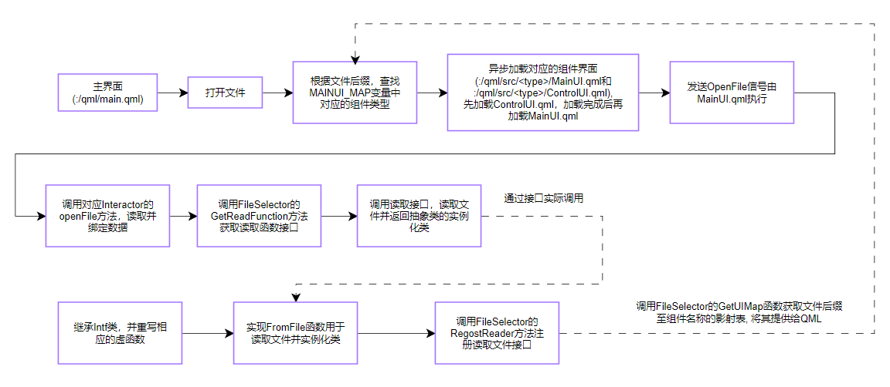

# 目录

* [编译](./docs/Build.md)
  * [依赖](./docs/Build.md#依赖)
  * [编译并打包](./docs/Build.md#编译并打包)
  * [特化版本编译](./docs/Build.md#特化版本编译)
* [系统架构](#系统架构)
  * [编译系统](#编译系统)
    * [①软件版本号](#Version)
    * [②组件](#Components)
    * [③开发/部署的配置隔离](#DevelopAndDeploy)
    * [④文件(夹)拷贝](#FileCopy)
    * [⑤打包](#Package)
    * [⑥归档](#Archive)
    * [⑦清理](#Cleanup)
    * [⑧GitHub自动化发布及变更文档(CHANGELOG.md)](#AutoReleaseAndChangeLog)
  * [UnionLib](./components/union/README.md)

## 系统架构



### 编译系统

项目的编译使用**CMake**作为构建工具，Qt的版本为：**`5.15.x(msvc)`**
<a id="Version"></a>
#### ①软件版本号

项目中，使用[`git describe`(点击此处获取相关帮助)](https://git.js.cn/docs/git-describe)的返回值作为软件的版本号。开发中，可以从`morose_config.h`头文件中的`APP_VERSION`宏获取版本号。
<a id="Components"></a>
#### ②组件

项目中，默认会搜索`components`和`extensions`目录下的所有压缩包(仅支持`.rar、.7z、.zip`)和文件夹，

在CMake的配置阶段，会将所有搜索到的压缩包解压到同级目录(**注意**:如果需要添加压缩包的话需要在外层目录打包)，

然后判断所有的子目录是否含有`CMakeLists.txt`如果有则调用`add_subdirectory`命令将其加入到构建系统。

> 压缩包形式的组件适用于**不需要频繁更改，且二进制文件较多**的组件(如预编译库)，这将显著缩小源码的体积。
<a id="DevelopAndDeploy"></a>
#### ③开发/部署的配置隔离

**开发模式(Debug配置)**: CMake会将`config/ProductConfig.json`文件拷贝至二进制的生成目录(.exe的生成目录)下，同时重名名为`Config.json`,

**如果`config`目录下没有`ProductConfig.json`文件**，转而会拷贝`config/DeployConfig.json`文件。

程序中使用`getGlobalEnvironment()`函数可以获取，该文件的信息，**注意:** 该函数的调用必须在`loadGlobalEnvironment()`函数之后调用

**部署模式(Release配置)**: CMake会忽略`config/ProductConfig.json`文件，拷贝`DeployConfig.json`。

> 项目中git默认忽略对`ProductConfig.json`文件的追踪，程序中使用的与本地环境相关的一些隐私变量或测试变量可以写入该文件，
>
> 该文件不会被git管理，同时也不会进入到部署环境。
<a id="FileCopy"></a>
#### ④文件(夹)拷贝

在项目的`CMakeList.txt`中，可以使用`morose_copy`函数，拷贝文件或文件夹，具体的函数声明如下：

```cmake
#[[
    拷贝文件至运行时目录和打包目录
    `morose_copy([TARGET] target [FILES] ... [DIRS] ... [DIST_DIR] dist_directory [RENAME] rename)`
    `TARGET`: 拷贝依赖
    `FILES`: 文件列表
    `DIRS`: 目录列表
    `DIST_DIR`: 拷贝目标文件夹
    `RENAME`: 重命名拷贝项目, 只有当`FILES`或者`DIRS`只有一个时才可以重命名
]]
function(morose_copy)

#[[
例如:
    morose_copy(TARGET ${PROJECT_NAME} DIRS "excel_templates")
    构建${PROJECT_NAME}目标之后，
    CMake会将该函数所在CMakeLists.txt同级目录下的excel_template文件夹，
    整个拷贝到二进制的生成目录
	
    如果想要拷贝到二进制文件生成目录下的test文件夹下，
    可以使用morose_copy(TARGET ${PROJECT_NAME} DIRS "excel_templates" DIST_DIR "test")
	
    如果想要同时重命名"excel_templates"为"template",
    可以使用morose_copy(TARGET ${PROJECT_NAME} DIRS "excel_templates" DIST_DIR "test" RENAME "template")
	
    普通文件的拷贝类似，只不过DIRS关键字需要替换为FILES
    注意：
        如果同时拷贝了多个文件或者文件夹时，不能调用RENAME
]] 
```

> 构建系统中，如果需要手动拷贝一些文件作为依赖，可以使用该方式，以保证唯一性。
<a id="Package"></a>
#### ⑤打包

部署环境下，构建系统会生成`generate_exe_installer`目标，用于打包发布。

1. 该目标会将生成的.exe文件拷贝至`${MOROSE_DIST_DIR}`(默认为:`${CMAKE_SOURCE_DIR}/output/${PROJECT_NAME}-${APP_VERSION}`)对应的目录下，

​	同时也会将`morose_copy`拷贝的文件，以开发环境的树结构(相对于开发环境生成的可执行文件)拷贝至`${MOROSE_DIST_DIR}`目录。

2. 调用`windeployqt.exe`命令，在`${MOROSE_DIST_DIR}`目录下拷贝依赖的Qt动态库和Qml文件。
3. 调用`ISCC.exe`(`InnoSetup`的可执行程序), 在`${MOROSE_INSALL_DIR}`(默认为:`${CMAKE_SOURCE_DIR}/output`)目录下构建安装包。
<a id="Archive"></a>
#### ⑥归档

部署环境下，构建系统会生成`Archive`目标，用于生成归档源码(生成于`${CMAKE_SOURCE_DIR}/output/${PROJECT_NAME}-${APP_VERSION}-arvhive.zip`)。

归档会将归档源码中的Git仓库删除，同时将版本号等信息写入到`archive.json`文件中。
<a id="Cleanup"></a>
#### ⑦清理

使用`clean-all`目标代替`clean` 目标用于清理，`clean-all`会将额外将所有的`morose_copy`产生的文件删除。

<a id="AutoReleaseAndChangeLog"></a>
#### ⑧GitHub自动化发布及变更文档(CHANGELOG.md)

向GitHub仓库推送tag时如果符合`v*`的规则，则会触发自动化编译和发布的流程，该流程会自动生成安装包和归档文件，并上传至Release。

并且，该流程还会收集当前发布的tag到上一次发布的tag中间所有的[提交信息(点击此处查看提交规范)](https://juejin.cn/post/6844903793033756680)，生成[CHANGELOG输出(点击此处查看相关文档)](https://github.com/mengyou1024/action-changelog?tab=readme-ov-file#example-config-file)并推送至仓库的CHANGELOG.md
