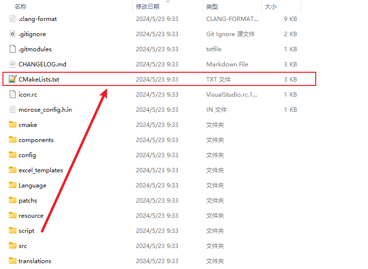
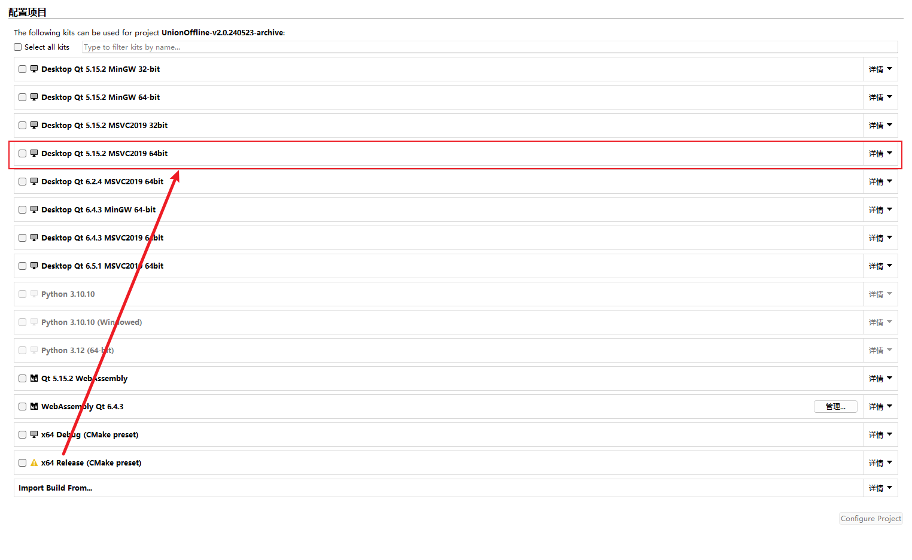
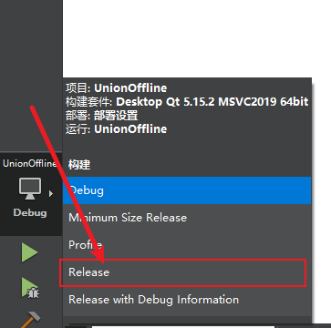
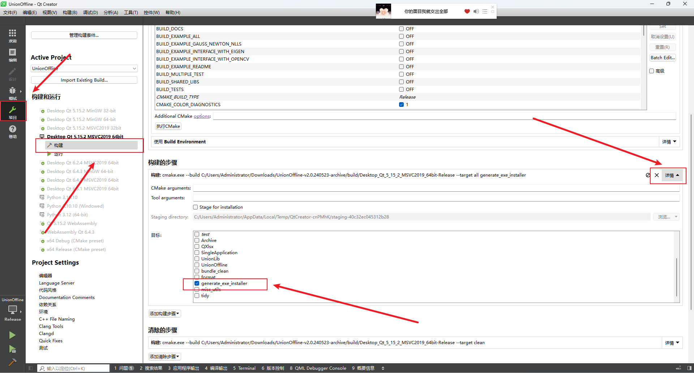
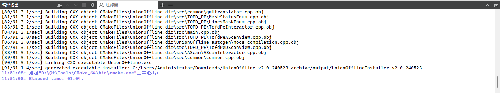

### 依赖

* `Qt=5.15.x` 
  * `QQuick`
  * `QWidgets`
  * `QCharts`
  * `QCharts`
  * `QSerialPort`
* `InonSetup >= 6`
* `QtCreator`

### 编译并打包

1. 下载归档文件并解压

2. 打开`QtCreator`

3. 点击打开项目

   

4. 选择文件中的`CMakeList.txt`文件

   

5. 选择`Qt 5.15.2 MSVC2019 64bit`再点击`Configure Project`

   

6. 选择`Release`模式

   

7. 点击`项目`-`构建`-`构建的步骤`, 勾选`generate_exe_installer`

   

8. 点击按钮

   

9. 编译成功如下: 

   

   生成的安装文件在源码目录中的output目录中

### 特化版本编译

1. `git clone <repo url> --recursive`完整克隆本仓库
2. `git apply patchs/<patch name>.patch`应用补丁
3. 剩余步骤和普通版本类似

> 特化版本无法使用自动化流程

